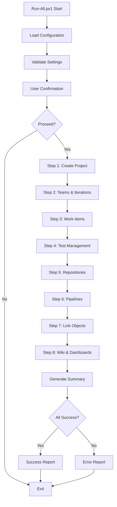

# Implementation Guide: ADO Sample Project Generator

## Architecture Overview

This solution uses a **modular, script-based architecture** with PowerShell and Azure DevOps REST API to programmatically generate comprehensive ADO projects. The design prioritizes maintainability, reusability, and comprehensive coverage of ADO object types.

## Design Principles

### 1. **Separation of Concerns**
Each script handles a specific domain:
- Project structure (teams, areas, iterations)
- Work item hierarchy
- Test management
- Source control
- CI/CD pipelines
- Cross-object relationships
- Documentation and reporting

### 2. **API-First Approach**
Direct REST API calls provide:
- **Maximum Control**: Fine-grained control over object properties
- **Flexibility**: Easy to modify and extend (supports both YAML and Classic pipelines)
- **Portability**: Works on any platform with PowerShell
- **Documentation**: Clear API endpoints for reference
- **Type Awareness**: Handles different content types (application/json for classic, application/json-patch+json for YAML)

### 3. **Configuration-Driven**
Centralized JSON configuration enables:
- Easy customization without code changes
- Environment-specific settings
- Reusable templates
- Version-controlled configurations

### 4. **Idempotency**
Scripts check for existing objects and skip creation when appropriate, allowing:
- Safe re-runs
- Incremental updates
- Recovery from failures

## Component Architecture

### Core Components

```
┌─────────────────────────────────────────────────────────────┐
│                      Run-All.ps1                             │
│                 (Orchestration Layer)                        │
│  - Script sequencing                                         │
│  - Progress tracking                                         │
│  - Error handling                                            │
│  - Summary reporting                                         │
└───────────────────────┬─────────────────────────────────────┘
                        │
                        │ calls
                        ↓
┌─────────────────────────────────────────────────────────────┐
│              Setup Scripts (Business Logic)                  │
│  ┌─────────────────────────────────────────────────────┐   │
│  │ 01 - Create Project                                  │   │
│  │ 02 - Setup Teams/Areas/Iterations                    │   │
│  │ 03 - Create Work Items                               │   │
│  │ 04 - Create Test Management                          │   │
│  │ 05 - Create Repositories                             │   │
│  │ 06 - Create Pipelines                                │   │
│  │ 07 - Link Objects                                    │   │
│  │ 08 - Create Wiki/Dashboards                          │   │
│  └─────────────────────────────────────────────────────┘   │
└───────────────────────┬─────────────────────────────────────┘
                        │
                        │ uses
                        ↓
┌─────────────────────────────────────────────────────────────┐
│           ado-api-helper.ps1 (Utility Layer)                │
│  - Get-AdoHeaders: Authentication                           │
│  - Invoke-AdoRestApi: Generic REST wrapper                  │
│  - New-AdoUri: URL construction                             │
│  - Get-AdoConfig: Configuration loading                     │
│  - Retry logic and rate limiting                            │
└───────────────────────┬─────────────────────────────────────┘
                        │
                        │ reads
                        ↓
┌─────────────────────────────────────────────────────────────┐
│              config.json (Configuration)                     │
│  - Organization settings                                     │
│  - Project configuration                                     │
│  - Object count targets                                      │
│  - Team definitions                                          │
│  - User assignments                                          │
└─────────────────────────────────────────────────────────────┘
```

## Script Execution Flow

### Sequential Execution Model



### Dependency Chain

Each script depends on outputs from previous scripts:

1. **Project Creation** → Establishes base project
2. **Teams/Areas/Iterations** → Provides organizational structure
3. **Work Items** → Creates trackable items (outputs: work item IDs)
4. **Test Management** → References work items for test coverage
5. **Repositories** → Provides code context
6. **Pipelines** → References repositories for CI/CD
7. **Link Objects** → Uses IDs from all previous steps
8. **Wiki/Dashboards** → Aggregates information from all objects

## Data Models

### Work Item Hierarchy

```
Epic (3)
  ├── Feature (2-3 per Epic = 8 total)
  │     ├── User Story (2-3 per Feature = 20 total)
  │     │     ├── Task (1-2 per Story = 30 total)
  │     │     └── Bug (10 total, distributed)
  │     └── Test Case (15 total, linked to stories as work items)

Total Work Items: 71
```

### Test Management Structure

```
Test Plan (5)
  ├── Test Suite: Static
  │     └── Test Case (8-10 per suite)
  ├── Test Suite: Requirement-Based
  │     └── Test Case (linked to User Stories)
  └── Test Suite: Query-Based
        └── Test Case (filtered by tags/state)
```

### Repository Structure

```
Main Repository
  ├── main branch (protected)
  │     └── Initial commit with README.md, src/Program.cs, tests/ProgramTests.cs
  ├── feature/user-authentication branch
  │     └── Commits: UserAuthService.cs, UserController.cs
  ├── feature/api-integration branch
  │     └── Commits: ApiClient.cs
  ├── feature/logging-improvements branch
  │     └── Commits: Logger.cs, LogConfig.cs
  └── bugfix/fix-null-reference branch
        └── Commits: BugFix.cs

Pull Requests (4 per repository)
  ├── PR #1: feature/user-authentication → main
  │     ├── Description with checklist and related work items
  │     ├── Review Comments: "LGTM!", "Could you add more tests?"
  │     └── Approval: Approved (vote=10)
  ├── PR #2: feature/api-integration → main
  │     ├── Description with checklist
  │     ├── Review Comments: "Please update docs", "Consider error handling"
  │     └── Approval: Approved (vote=10)
  ├── PR #3: feature/logging-improvements → main
  │     └── (Similar structure)
  └── PR #4: bugfix/fix-null-reference → main
        └── (Similar structure)
```

## REST API Implementation Patterns

### Authentication Pattern

```powershell
# PAT-based authentication with Basic auth scheme
$base64AuthInfo = [Convert]::ToBase64String(
    [Text.Encoding]::ASCII.GetBytes(":$PAT")
)
$headers = @{
    "Authorization" = "Basic $base64AuthInfo"
    "Content-Type" = "application/json-patch+json"  # For YAML pipelines
}

# For Classic pipelines, use different Content-Type
$classicHeaders = @{
    "Authorization" = "Basic $base64AuthInfo"
    "Content-Type" = "application/json"  # For Classic pipelines
}
```

### Pipeline Type Differences

**YAML Pipelines:**
- Content-Type: `application/json-patch+json`
- Endpoint: `/_apis/pipelines`
- Format: JSON Patch operations with YAML file reference

**Classic Pipelines:**
- Content-Type: `application/json`
- Build Endpoint: `/_apis/build/definitions`
- Release Endpoint: `/_apis/release/definitions`
- Format: Complete definition object with tasks array

### Classic Pipeline Definition Structure

```powershell
# Classic Build Pipeline
$buildDefinition = @{
    name = "Main-App-Classic-CI"
    type = "build"
    repository = @{
        id = $repoId
        type = "TfsGit"
        defaultBranch = "refs/heads/main"
    }
    process = @{
        type = 1  # Designer process (not YAML)
        phases = @(
            @{
                name = "Build Phase"
                steps = @(
                    @{ task = @{ id = "333b11bd-d341-40d9-afcf-b32d5ce6f23b" }; inputs = @{ ... } },  # NuGet
                    @{ task = @{ id = "c6c4c611-aa2e-4a33-b606-5eaba2196824" }; inputs = @{ ... } },  # Build
                    @{ task = @{ id = "0b0f01ed-7dde-43ff-9cbb-e48954daf9b1" }; inputs = @{ ... } }   # Test
                )
            }
        )
    }
    triggers = @( @{ branchFilters = @("+refs/heads/main", "+refs/heads/develop"); triggerType = "continuousIntegration" } )
}

# Classic Release Pipeline
$releaseDefinition = @{
    name = "Main-App-Classic-CD"
    environments = @(
        @{
            name = "Dev"
            rank = 1
            deployPhases = @( @{ name = "Deploy"; workflowTasks = @(...) } )
        },
        @{
            name = "Production"
            rank = 4
            preDeployApprovals = @{ approvals = @( @{ isAutomated = $false } ) }
        }
    )
    artifacts = @( @{ type = "Build"; alias = "_Main-App-Classic-CI" } )
}
```

### JSON Patch Pattern for Work Items

Azure DevOps Work Item API uses JSON Patch (RFC 6902) for creating/updating work items:

```powershell
$operations = @(
    @{
        op = "add"                              # Operation type
        path = "/fields/System.Title"           # Field path
        value = "User Story Title"              # Value
    },
    @{
        op = "add"
        path = "/relations/-"                   # Add to relations array
        value = @{
            rel = "System.LinkTypes.Hierarchy-Reverse"
            url = $parentUrl
        }
    }
)
```

### Retry Logic Pattern

```powershell
function Invoke-AdoRestApi {
    param($Uri, $Method, $Headers, $Body, $MaxRetries = 3)
    
    $attempt = 0
    $delay = 2
    
    while ($attempt -lt $MaxRetries) {
        try {
            return Invoke-RestMethod -Uri $Uri -Method $Method `
                -Headers $Headers -Body $Body
        }
        catch {
            $attempt++
            if ($attempt -ge $MaxRetries) { throw }
            
            # Exponential backoff
            Start-Sleep -Seconds ($delay * [Math]::Pow(2, $attempt))
        }
    }
}
```

## Key Technical Decisions

### Why PowerShell?

1. **Native to Windows**: No additional runtime required
2. **Azure DevOps Integration**: First-class support in ADO agents
3. **REST API Friendly**: Built-in JSON and HTTP capabilities
4. **Script Simplicity**: Easy to read, modify, and maintain

### Why REST API vs. Azure DevOps CLI?

| Aspect | REST API | Azure DevOps CLI |
|--------|----------|------------------|
| Control | Full control over all fields | Limited to CLI commands |
| Flexibility | Any API endpoint | Only supported commands |
| Debugging | Clear HTTP requests/responses | CLI abstraction |
| Documentation | Microsoft REST API docs | CLI help text |
| Complexity | Requires manual API knowledge | Simplified commands |

**Decision**: REST API for comprehensive object creation and fine-grained control.

### Why Sequential vs. Parallel Execution?

**Sequential execution** chosen because:
- Objects have dependencies (e.g., work items must exist before linking)
- Rate limiting concerns with ADO APIs
- Easier debugging and error tracking
- Clear progress indication
- Idempotency is more important than speed

## Error Handling Strategy

### Three-Layer Error Handling

1. **Script-Level**
   ```powershell
   try {
       # Script operations
   }
   catch {
       Write-Host "Error: $_" -ForegroundColor Red
       # Continue or exit based on severity
   }
   ```

2. **API-Level** (in helper functions)
   ```powershell
   # Retry logic for transient errors
   # HTTP status code handling
   # Rate limit detection
   ```

3. **Orchestration-Level** (Run-All.ps1)
   ```powershell
   # Track completed and failed steps
   # Generate summary report
   # Provide next steps for recovery
   ```

### Error Recovery

- **Idempotent Operations**: Scripts check for existing objects
- **State Tracking**: Completed steps are recorded
- **Partial Completion**: Failed steps don't rollback successful ones
- **Manual Recovery**: Individual scripts can be re-run

## Performance Considerations

### API Call Optimization

1. **Batch Operations**: Group related API calls where possible
2. **Minimal Delays**: Small sleeps between API calls (300-500ms)
3. **Parallel Queries**: Read operations can be parallelized (future enhancement)
4. **Caching**: Store IDs and references to avoid re-querying

### Execution Time Estimates

| Script | Estimated Time | Primary Factor |
|--------|---------------|----------------|
| 01-create-project | 30-60s | Project creation latency |
| 02-teams-areas | 1-2 min | Team and classification nodes + 9 boards |
| 03-work-items | 2-4 min | 71 work items + 5 image attachments × API latency |
| 04-test-management | 3-5 min | Test plans, suites, cases |
| 05-repositories | 2-4 min | Git operations for 6 repositories |
| 06-pipelines | 4-6 min | 17 pipeline definitions (9 builds + 8 releases, YAML + Classic) |
| 07-link-objects | 2-4 min | Relationship creation |
| 08-wiki-dashboards | 2-3 min | Wiki pages and dashboards |
| **Total** | **16-28 min** | Network and ADO performance |

## Extension Points

### Adding New Work Item Types

```powershell
# In 03-create-work-items.ps1
$newItemType = @{
    op = "add"
    path = "/fields/System.WorkItemType"
    value = "Custom Item Type"
}

# Add to creation loop
```

### Adding New Pipeline Types

```powershell
# In 06-create-pipelines.ps1
# Add new YAML definition to repository
# Reference in pipeline creation API call
```

### Customizing Team Structure

```json
// In config.json
{
  "teams": [
    {
      "name": "New Team",
      "areaPath": "Custom Area",
      "description": "Team description"
    }
  ]
}
```

## Security Considerations

### Personal Access Token (PAT)

- **Scope Principle**: Grant minimum required permissions
- **Expiration**: Use short-lived tokens (90 days max)
- **Storage**: Never commit PAT to source control
- **Rotation**: Regularly regenerate tokens

### Configuration Security

```powershell
# Good: Environment variable
$pat = $env:ADO_PAT

# Good: Secure prompt
$pat = Read-Host "Enter PAT" -AsSecureString

# Bad: Hardcoded
$pat = "actual_token_value"  # NEVER DO THIS
```

### Audit Trail

All operations are logged in ADO:
- Work item creation history
- Repository commits
- Pipeline run records
- Admin action logs

## Testing Strategy

### Manual Testing Checklist

After running scripts:
1. ✅ Verify project exists in ADO
2. ✅ Check team structure in Project Settings
3. ✅ Review work items in Boards
4. ✅ Inspect test plans in Test Plans
5. ✅ Browse repositories in Repos
6. ✅ Check pipeline definitions in Pipelines
7. ✅ Validate wiki pages
8. ✅ Review dashboards

### Validation Queries

Use these ADO queries to verify data:

```sql
-- All work items by type
SELECT [System.Id], [System.WorkItemType], [System.Title], [System.State]
FROM WorkItems
WHERE [System.TeamProject] = @project
ORDER BY [System.WorkItemType], [System.Id]

-- Work item hierarchy
SELECT [System.Id], [System.Title], [System.WorkItemType]
FROM WorkItemLinks
WHERE ([Source].[System.TeamProject] = @project)
AND ([System.Links.LinkType] = 'System.LinkTypes.Hierarchy-Forward')
ORDER BY [System.Id]
```

## Troubleshooting Guide

### Common Issues

#### Issue: "Project already exists"
**Solution**: Use `-SkipProjectCreation` flag or delete existing project

#### Issue: "Unauthorized" errors
**Solution**: 
1. Verify PAT is valid
2. Check PAT scopes include all required permissions
3. Ensure organization access

#### Issue: "Rate limit exceeded"
**Solution**:
1. Increase delays in `ado-api-helper.ps1`
2. Run scripts individually with pauses between
3. Check organization-level rate limits

#### Issue: Work item links fail
**Solution**:
1. Ensure parent work items exist first
2. Verify work item IDs are correct
3. Check link type names

### Debug Mode

Enable verbose output:

```powershell
$VerbosePreference = "Continue"
.\Run-All.ps1 -Verbose
```

### API Response Inspection

```powershell
# Add to scripts for debugging
$response = Invoke-AdoRestApi -Uri $uri -Method POST -Headers $headers -Body $body
$response | ConvertTo-Json -Depth 10 | Write-Verbose
```

## Maintenance and Updates

### Updating API Versions

ADO REST API uses versioned endpoints:

```powershell
# Current
$apiVersion = "7.0"

# Update globally in ado-api-helper.ps1
function New-AdoUri {
    param($ApiVersion = "7.0")  # Change default here
}
```

### Adding New ADO Features

1. Research API endpoint in [Microsoft Docs](https://learn.microsoft.com/en-us/rest/api/azure/devops/)
2. Add helper function to `ado-api-helper.ps1`
3. Create or update setup script
4. Update configuration schema
5. Document in README.md

## Future Enhancements

### Planned Improvements

1. **Parallel Execution**: Run independent scripts in parallel
2. **Progress Bar**: Real-time progress indicators
3. **Detailed Logging**: File-based logs with timestamps
4. **Cleanup Script**: Remove created objects for testing
5. **Configuration Validator**: Pre-flight checks before execution
6. **Export Functionality**: Export existing ADO project structure
7. **Comparison Tool**: Verify migration completeness

### Community Contributions

Areas for contribution:
- Additional pipeline templates
- More work item types and templates
- Enhanced error recovery
- Cross-platform testing (Linux, macOS)
- Performance optimizations
- Unit tests for helper functions

## References

### Azure DevOps REST API

- [Projects API](https://learn.microsoft.com/en-us/rest/api/azure/devops/core/projects)
- [Work Items API](https://learn.microsoft.com/en-us/rest/api/azure/devops/wit/work-items)
- [Git API](https://learn.microsoft.com/en-us/rest/api/azure/devops/git)
- [Build API](https://learn.microsoft.com/en-us/rest/api/azure/devops/build)
- [Release API](https://learn.microsoft.com/en-us/rest/api/azure/devops/release)
- [Test API](https://learn.microsoft.com/en-us/rest/api/azure/devops/test)
- [Wiki API](https://learn.microsoft.com/en-us/rest/api/azure/devops/wiki)

### PowerShell Resources

- [PowerShell Documentation](https://learn.microsoft.com/en-us/powershell/)
- [Invoke-RestMethod](https://learn.microsoft.com/en-us/powershell/module/microsoft.powershell.utility/invoke-restmethod)
- [JSON Patch RFC 6902](https://tools.ietf.org/html/rfc6902)

---

## Summary

This implementation provides a **robust, maintainable, and extensible** solution for generating comprehensive ADO sample projects. The architecture balances:

- **Simplicity**: Easy-to-understand script structure
- **Completeness**: Covers all major ADO object types
- **Reliability**: Error handling and retry logic
- **Flexibility**: Configuration-driven and modular design

The result is a tool that can reliably generate realistic ADO projects for thorough migration testing.
